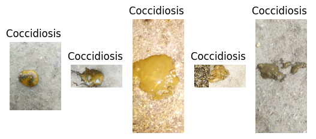
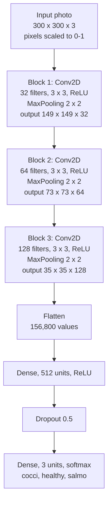
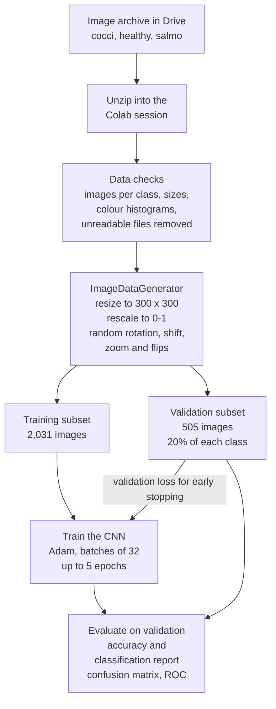
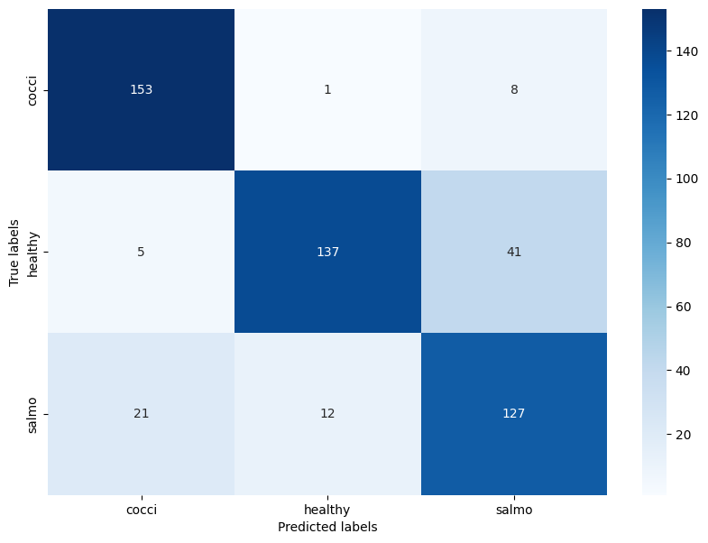
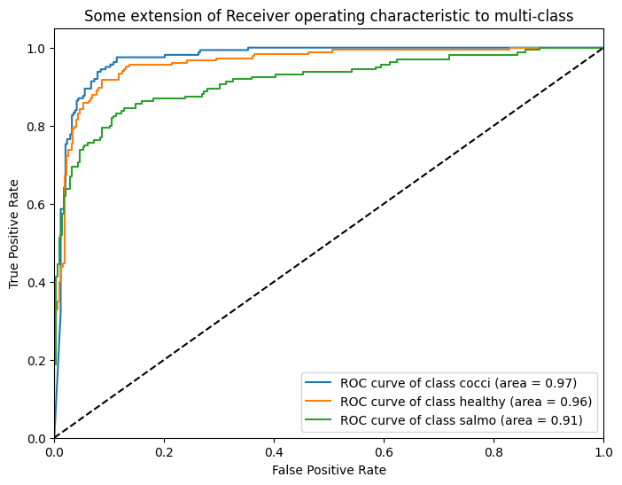
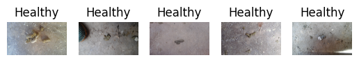
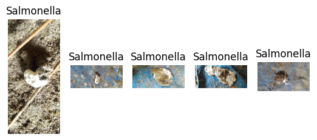
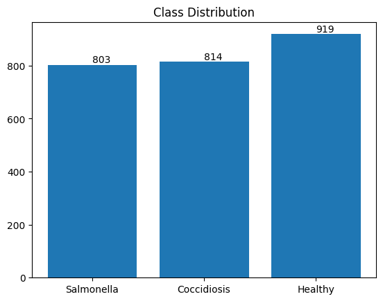
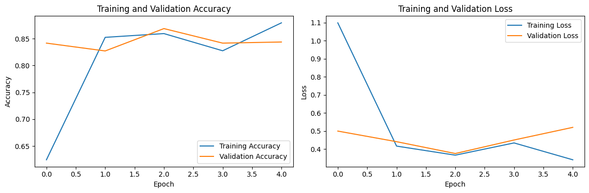

# Poultry Disease Detection with a Convolutional Neural Network

[](https://colab.research.google.com/github/samiulhuda360/Diagnosing-Chicken-Diseases-via-Convolutional-Neural-Networks/blob/main/Chichen_disease_detection.ipynb)


**A deep learning image classifier that screens chickens for Coccidiosis and Salmonella from photos of their
droppings.** A convolutional neural network, trained from scratch in TensorFlow/Keras on 2,536 photos, sorts each
image into Coccidiosis, Salmonella or healthy with 84.8% validation accuracy. Both diseases change the appearance of
droppings, so a photo gives poultry farms and vets a cheap, non-invasive first check. The notebook is also a complete
computer-vision workflow for reviewers: data checks, augmentation, training and evaluation in one place.



| | |
|---|---|
| **Problem** | 3-class image classification: Coccidiosis, healthy, Salmonella |
| **Data** | 2,536 droppings photos (814 Coccidiosis, 919 healthy, 803 Salmonella): 2,031 train the model, 505 are held out for validation |
| **Model** | CNN built from scratch: 3 convolution and max-pooling blocks, a 512-unit dense layer, dropout 0.5, softmax over 3 classes |
| **Result** | **84.8% validation accuracy**, macro F1 0.83, one-vs-rest ROC-AUC 0.97 / 0.96 / 0.91 (Coccidiosis / healthy / Salmonella) |

## Key features

- **Three-way screening** of droppings photos: Coccidiosis, Salmonella or healthy, with a probability for each class.
- **A convolutional neural network trained from scratch** in Keras: no pretrained weights.
- **Data checks before training:** images per class, height and width distributions, colour histograms per class, and a
  pass that removes files OpenCV can't read.
- **On-the-fly augmentation** with `ImageDataGenerator`: random rotation, shifts, zoom and horizontal flips, so the
  model learns the sample rather than the camera angle.
- **Early stopping** on validation loss.
- **Evaluation beyond accuracy:** per-class precision, recall and F1, a confusion matrix, one-vs-rest ROC curves and
  training curves.
- **One notebook that runs on Google Colab,** reading the images from Google Drive.

## Architecture

The network stacks three convolution blocks and a small classifier head. Each 3 x 3 convolution (no padding) is
followed by 2 x 2 max pooling, so the feature maps shrink from 300 x 300 to 35 x 35 while the number of filters grows
from 32 to 128.



The model is compiled with the Adam optimiser and categorical cross-entropy loss, and tracks accuracy.

## How it works



1. **Load the data.** The notebook mounts Google Drive, unzips the image archive and points at one folder per class:
   `cocci`, `healthy` and `salmo`.
2. **Check the data.** It counts the images in each class (814, 919 and 803, so the classes are close to balanced),
   shows five samples per class, plots the distributions of image height and width, compares colour histograms for one
   sample of each class, and removes any file OpenCV can't read (this dataset has none).
3. **Preprocess and augment.** One `ImageDataGenerator` resizes every photo to 300 x 300, rescales pixel values to
   [0, 1] and applies random rotation (up to 20 degrees), width and height shifts (up to 20%), zoom (up to 15%) and
   horizontal flips. Its `validation_split=0.2` holds out 20% of each class folder: 2,031 images train the model and
   505 validate it.
4. **Train.** The CNN above trains with Adam and categorical cross-entropy in batches of 32 for up to 5 epochs, with
   early stopping on validation loss (patience 3).
5. **Evaluate.** `model.evaluate` reports validation loss and accuracy, and `model.predict` feeds the classification
   report, the confusion matrix and the one-vs-rest ROC curves.

## Results

Validation subset, 505 images:

| Class | Precision | Recall | F1 | ROC-AUC | Images |
|---|---|---|---|---|---|
| Coccidiosis | 0.85 | **0.94** | 0.90 | 0.97 | 162 |
| Healthy | 0.91 | 0.75 | 0.82 | 0.96 | 183 |
| Salmonella | 0.72 | 0.79 | 0.76 | 0.91 | 160 |
| **Macro average** | 0.83 | 0.83 | **0.83** | | 505 |

| Confusion matrix (validation, 505 images) | ROC curves, one-vs-rest |
|---|---|
|  |  |

- **Coccidiosis has the highest recall:** 153 of 162 cases are caught (94%).
- **The most common error is a healthy sample predicted as Salmonella** (41 of 183 healthy samples). In a screening
  tool this is a false alarm that leads to a follow-up check, not a missed infection.
- **Salmonella is the hardest class to separate** (ROC-AUC 0.91): 21 Salmonella samples are predicted as Coccidiosis
  and 12 as healthy.

**How it's measured.** Every number comes from the 505 validation images, which the model never trains on.
`model.evaluate` gives the 84.8% accuracy (validation loss 0.53). The classification report, the confusion matrix and
the ROC curves come from `model.predict` over the same images. The validation subset is read through the same
augmenting generator as the training subset, so each pass sees slightly different shifts, zooms and rotations: the
pass behind the confusion matrix classifies 417 of 505 images correctly (82.6%). The run shown completed all 5 epochs.

## Figures

All figures are outputs of the notebook.

**Healthy samples.** Five photos from the `healthy` class.



**Salmonella samples.** Five photos from the `salmo` class.



**Class balance.** 803 Salmonella, 814 Coccidiosis and 919 healthy images.



**Training curves.** Training and validation accuracy and loss for each of the 5 epochs.



## Tech stack

Python · TensorFlow / Keras · OpenCV · NumPy · pandas · scikit-learn · Matplotlib · seaborn · Jupyter · Google Colab

**Keywords:** computer vision, deep learning, convolutional neural network, image classification, data
augmentation, agriculture AI, AgriTech, poultry health, animal disease detection, Coccidiosis, Salmonella,
precision and recall, ROC-AUC, confusion matrix.

## Getting started

### Prerequisites

- A Google account to run the notebook on Google Colab (the notebook asks for a GPU runtime), or Python 3 with Jupyter
  to run it locally.
- The image archive, which isn't stored in this repository: a zip file named `Chicken_disease-2.zip` that holds a
  `Chicken_disease-2/` folder with one subfolder per class, `cocci/`, `healthy/` and `salmo/`.

### Run on Google Colab

1. Upload `Chicken_disease-2.zip` to the top level of your Google Drive (**My Drive**).
2. Click **Open in Colab** at the top of this page.
3. Run the cells in order. **Runtime > Run all** works too: it asks for Drive access in the first cell and pauses at
   the photo-upload cell near the end until you choose an image.

If the archive is somewhere else in your Drive, change `zip_path` in the cell that unzips it.

### Run locally

```bash
git clone https://github.com/samiulhuda360/Diagnosing-Chicken-Diseases-via-Convolutional-Neural-Networks
cd Diagnosing-Chicken-Diseases-via-Convolutional-Neural-Networks
pip install -r requirements.txt
jupyter notebook Chichen_disease_detection.ipynb
```

The Drive-mount cell and the photo-upload cell use `google.colab`, which exists only on Colab, so skip them. Then
point the data paths at your copy of the images:

| Variable | What it points to |
|---|---|
| `zip_path`, `extraction_path` | the archive and the folder it is unzipped into |
| `healthy_dir`, `salmo_dir`, `cocci_dir` | the three class folders, used by the data checks |
| `root_dir` | the folder that holds the three class folders, used by the generators |

### Configuration

There are no environment variables. The training settings are set in the notebook:

| Setting | Value | Purpose |
|---|---|---|
| `target_size` | `(300, 300)` | size every photo is resized to |
| `batch_size` | `32` | images per training step |
| `epochs` | `5` | maximum number of training epochs |
| `validation_split` | `0.2` | share of each class folder held out for validation |
| `EarlyStopping` | `monitor='val_loss', patience=3` | stops training when validation loss stops improving |

## Usage

The notebook runs from top to bottom and shows each stage as it goes:

| Stage | What you see |
|---|---|
| Data checks | images per class, five sample photos per class, image size histograms, colour histograms, the number of unreadable files removed |
| Generators | `Found 2031 images belonging to 3 classes.` and `Found 505 images belonging to 3 classes.` |
| Training | loss and accuracy for each epoch, on training and validation images |
| Evaluation | validation loss and accuracy, the classification report, the confusion matrix, training curves, and ROC curves per class and combined |

### Classify a new photo

The upload cell near the end (`files.upload()`) takes a photo, and the cell after it loads the photo at 300 x 300 and
scales it to [0, 1] as `img_array`. In the same session, this labels it with the trained model:

```python
probs = model.predict(img_array)[0]
labels = {index: name for name, index in train_generator.class_indices.items()}  # 0 cocci, 1 healthy, 2 salmo
print(labels[int(np.argmax(probs))], f"{probs.max():.0%}")
```

## Project structure

```
.
├── Chichen_disease_detection.ipynb   the whole pipeline: data checks, augmentation, CNN training and evaluation
├── docs/images/                      figures from the notebook: samples, class balance, curves, confusion matrix, ROC
├── requirements.txt                  Python packages for running the notebook locally
└── LICENSE                           MIT licence
```

## Reproducing the results

This is a notebook project, so there is no unit-test suite or CI workflow. Running the notebook end to end retrains
the model and regenerates every number and figure in this README from the images. No random seed is set and the
augmentation is random, so a re-run lands close to these numbers rather than exactly on them.

## Scope

- **Screening aid.** The model sorts droppings photos into three classes: Coccidiosis, Salmonella and healthy. Other
  conditions are outside these classes, and a positive result calls for a veterinary check.
- **Evaluation data.** The scores come from a 20% validation hold-out of one image collection. There is no separate
  test set or per-farm split.
- **Model lifetime.** The trained model lives in the notebook session; the notebook doesn't save it to disk. Label new
  photos in the same session, as shown in [Classify a new photo](#classify-a-new-photo).

## Licence

MIT, see [LICENSE](LICENSE).

## Author

[Samiul Huda](https://github.com/samiulhuda360) · MSc Data Science · Auckland, New Zealand
